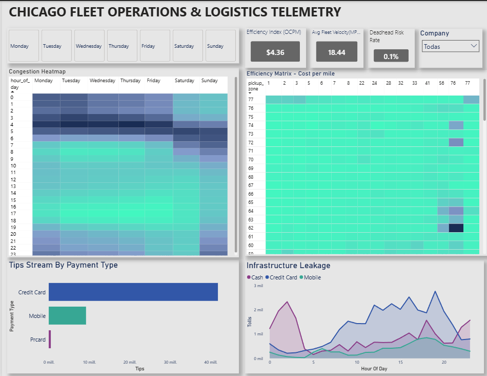

# 🚕 Chicago Fleet Operations  
## Logistics Telemetry & Efficiency Optimization



---

## 📉 Business Problem

Urban transportation fleets in **Chicago** operate in a highly dynamic and cost-sensitive environment.  
Prior to this project, fleet operators lacked consolidated visibility into key operational risks, including:

- **Cost Inefficiency:** Elevated *Operational Cost Per Mile (OCPM)* on specific routes went undetected.
- **Traffic Impact:** Limited understanding of how peak-hour congestion reduced fleet velocity (MPH) and increased idle time.
- **Profitability Leakage:** Long-distance, low-yield trips (*Deadhead Trips*) were not quantified, gradually eroding margins.

This lack of insight constrained data-driven operational and pricing decisions.

---

## 🎯 Project Objective

The goal of this project was to design and implement a **Logistics Control Tower** dashboard that delivers actionable insights into fleet performance.

The dashboard enables operations teams to:

- Monitor efficiency using a custom **Efficiency Index (OCPM)**.
- Identify congestion patterns to optimize driver schedules and shift allocation.
- Minimize **Deadhead Risk** while maximizing **Gratuity Yield (Tips)**.
- Support strategic decisions related to routing, pricing, and payment methods.

---

## 📊 The Data

- **Source:** `bigquery-public-data.chicago_taxi_trips`
- **Period:** 2024–2025
- **Scale:** +100,000 trip records

### Key Engineered Metrics

- **Operational Cost Per Mile (OCPM):**  
  `(Fare + Tolls) / Distance`
- **Fleet Velocity:**  
  Average speed in Miles Per Hour (MPH)
- **Deadhead Risk Rate:**  
  Percentage of trips longer than 10 miles with a yield below `$1.50 / mile`

---

## 🛠️ Technical Solution Stack

- **Google BigQuery (SQL):** Advanced data extraction, cleansing, and feature engineering.
- **Power BI:** Data modeling, DAX measures, and executive-level analytics.
- **Power Query:** Data transformation, weekday normalization, and custom sorting.
- **UI / UX:** Industrial  theme optimized for high-contrast telemetry monitoring.
  
---

## 💻 Data Engineering (SQL)

Data processing was performed in **BigQuery** using layered **CTEs** to ensure scalability, readability, and analytical accuracy before ingestion into Power BI.

```sql
/* Final Query for Logistics Optimization
   Target: BigQuery Public Dataset
*/

WITH base_trips AS (
  SELECT 
    unique_key AS trip_id,
    pickup_community_area AS pickup_zone,
    dropoff_community_area AS dropoff_zone,
    trip_start_timestamp,
    trip_miles,
    trip_seconds,
    fare,
    tolls,
    payment_type,
    EXTRACT(HOUR FROM trip_start_timestamp) AS hour_of_day,
    FORMAT_DATE('%A', DATE(trip_start_timestamp)) AS day_of_week,
    (COALESCE(fare, 0) + COALESCE(tolls, 0)) AS base_operational_cost
  FROM `bigquery-public-data.chicago_taxi_trips.taxi_trips`
  WHERE trip_start_timestamp >= '2024-01-01'
    AND trip_miles > 0.5
    AND fare > 0
    AND pickup_community_area IS NOT NULL 
    AND dropoff_community_area IS NOT NULL
),

metrics AS (
  SELECT *,
    SAFE_DIVIDE(base_operational_cost, trip_miles) AS cost_per_mile,
    SAFE_DIVIDE(trip_miles, (trip_seconds / 3600)) AS avg_speed_mph,
    CASE 
      WHEN trip_miles > 10 AND (fare / trip_miles) < 1.5 THEN 1 
      ELSE 0 
    END AS high_deadhead_risk
  FROM base_trips
)

SELECT *
FROM metrics
WHERE avg_speed_mph < 85
  AND cost_per_mile < 40;
```
🔍 Key Insights & Business Impact
1️⃣ Fleet Velocity & Congestion Impact

Insight:
The fleet operates at an average speed of 18.44 MPH, with critical congestion between 3:00 PM and 6:00 PM.

Business Impact:
Lower velocity increases idle time, reduces trip frequency, and raises cost per mile.

Actionable Recommendation:
Prioritize short-distance trips in high-density zones during peak hours.

2️⃣ Operational Cost Per Mile (OCPM) Optimization

Insight:
Average OCPM is $4.36, with cost spikes driven by tolls and congested pickup zones.

Business Impact:
High OCPM erodes margins and limits profitability.

Actionable Recommendation:

Renegotiate pricing for high-OCPM routes

Evaluate non-toll alternatives for non-priority trips

3️⃣ Deadhead Risk & Trip Profitability

Insight:
Only 0.1% of trips are high-risk, but they disproportionately affect margins.

Business Impact:
Small volumes of unprofitable trips accumulate into revenue leakage.

Actionable Recommendation:
Flag risky trips and apply dynamic pricing or reassignment.

4️⃣ Payment Method & Gratuity Yield

Insight:
Digital payments generate higher gratuities than cash.

Business Impact:
Higher tip yield improves driver earnings and transparency.

Actionable Recommendation:
Promote digital payments through driver incentives.

5️⃣ Executive-Level Decision Enablement

Insight:
Combined metrics create a Logistics Control Tower view.

Business Impact:
Faster, data-driven operational decisions.

Actionable Recommendation:
Use the dashboard for daily monitoring and strategic planning.


👤 Author

Developed by: Helian Fierro

LinkedIn: https://www.linkedin.com/in/helian-fierro-oyola-143798206/

Portfolio / GitHub: https://helian1505.github.io/Projects/
